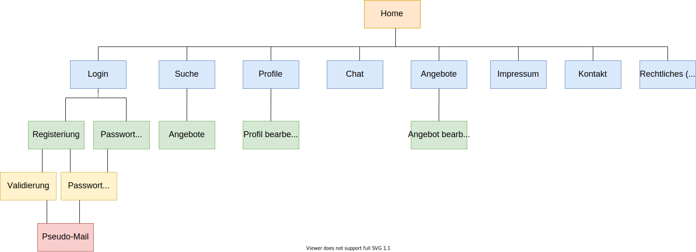

<h1 align="center">Platypurse Dokumentation</h1>
<h2 align="center">inf016 Webprogrammierung - Gruppe K<br>im Sommersemester 2020</h2>
<h3 align="center"><a href="https://github.com/daylien">Malte Grave</a>, <a href="https://github.com/derPiepmatz">Tim Hesse</a>, <a href="https://github.com/ceitcher">Marvin Kuhlmann</a></h3>

<p align="center">
  
</p>


# Inhaltsverzeichnis
1. [Generelles](#generelles)
2. [Konfiguration](#konfiguration)
    1. [PHP.ini](#phpini)
    2. [Apache](#apache)
    3. [Installation](#installation)
    4. [Testen](#testen)
3. [Features](#features)
4. [Aufgaben und Korrektheit](#aufgaben-und-korrektheit)
5. [Nicht umgesetzte Funktionen](#nicht-umgesetzte-funktionen)
6. [Fehler oder Mängel](#fehler-oder-mängel)


# Generelles

Wir freuen uns, euch unsere fertige Abgabe nun zur Verfügung zu stellen. Wir bitten euch dieses Dokument komplett durchzulesen, damit keine ungewollten Nebeneffekte oder Situationen bei der Benutzung der Webseite entstehen. Bei Fragen oder evtl. sogar Fehler bitten wir euch, uns zu kontaktieren. Vielen Dank!

# Konfiguration

Um dieses Projekt erfolgreich zu starten, müssen zuerst Einstellungen am Webserver vorgenommen werden.
Aufgrund der Spezifikation der Vorlesung wird davon ausgegangen, dass die Installation über XAMPP erfolgte.
Es wird auch Docker unterstützt. Jedoch nicht aktiv, da auf Nachfrage keine Dockerkonfiguration als Abgabe akzeptiert wurde.

## PHP.ini

In der PHP.ini muss nicht viel eingestellt werden, es muss lediglich der Upload aktiviert und das Uploadlimit auf 2MB gesetzt werden.

```ini
file_uploads=On
upload_max_filesize=2M
```

Außerdem haben wir das das Memory Limit etwas erhöht damit alles etwas performanter läuft. Dies regelt die Applikation von alleine [Zeile 22-24](public/index.php#L22).
## Apache

Da unser Projekt als MVC-Framework aufgesetzt ist, wird die URL relativ gemappt. Diese muss von Apache entsprechend auf unsere ``index.php`` aufgelöst werden.

Dafür muss ``mod_rewrite`` aktiviert werden. Dazu bitte Folgendes in die ``httpd.conf`` eingeben:

Unter XAMPP:
````ini
LoadModule rewrite_module modules/mod_rewrite.so
````

Hier wird davon ausgegangen, dass sich das Projekt im ``htdocs`` Ordner von XAMPP befindet.
Falls VHost benutzt werden sollte, bitte das ``DocumentRoot`` anpassen. 

## Installation

Die ``.zip``-Datei muss im XAMPP root ``(htdocs)`` entpackt werden, sodass sich die Dateien unter ``htdocs/Platypurse/`` befinden. Danach kann auf dem Webserver zugegriffen werden. Standartmäßig ist die Adresse ``http://localhost/Platypurse/``.
Beim ersten Start wird die Datenbank erstellt und mit Testdaten gefüllt. Nach einer kurzen Wartezeit wird dann auf die Startseite geleitet.
Von hier an kann die Seite in vollem Umfang benutzt werden.

## Testen

In der Datenbank werden standardmäßig neun Angebote angelegt. 
In ``public\index.php`` steht in Zeile 38 ein Faktor, wie häufig zusätzliche neun Angebote eingefügt werden sollen, die alle vom User "ShadowStabber69_HD" erstellt werden.
Dadurch kann der Testbetrieb mit sehr vielen Angeboten stattfinden.

Um die Webseite vollständig testen zu können, stellen wir folgende Benutzer zur Verfügung.

* Administrator (Super User)
  * Administrator
    * E-Mail: admin@platypurse.com
    * Passwort: 123

* Benutzer (Normale Benutzer)
  * SchnabelFan1337
    * E-Mail: schnabelfan@ymail.com
    * Passwort: 123
  * ShadowStabber69_HD
    * E-Mail: yrtwk@gmail.com
    * Passwort: 123
  * Harald
    * E-Mail: harald.haraldsen@outlook.com
    * Passwort: 123

* Support (Spezieller Benutzer für den Support)
  * Support
    * E-Mail: support@platypurse.com
    * Passwort: 123


# Features

Um einen groben Überblick über die grundlegenden Funktionen der Seite zu schaffen, wurde diese Sitemap erstellt:



Es folgt eine Liste der Funktionen, die auf der Seite implementiert wurden.

## Funktionen

* Benutzer
  * Registrierung
  * Login
  * Password vergessen
  * Eigenes Profil bearbeiten
    * Name (Freitext)
    * Avatar (Bilddatei kleiner 2 MB)
    * Passwort (Freitext)
  * Chat zwischen Usern
  * User Rating
  * Pseudo E-Mails für:
    * Registrierung
    * Passwort vergessen
  * Übersicht eigener Angebote
  * Übersicht gemerkter Angebote
  * Löschen und bearbeiten eigener Angebote

* Angebote
  * Angebot erstellen
    * Name (Pflicht, Freitext)
    * Preis (Pflicht, Gleitkommazahl)
    * Bild (Optional, Bilddatei kleiner 2 MB)
    * Beschreibung (Optional, Freitext)
    * Geschlecht (Pflicht, Auswahl über Dropdown)
    * Alter (Pflicht, Zahl zwischen 0 und 20)
    * Körpergröße (Pflicht, Zahl zwischen 0 und 75)
    * Gewicht (Pflicht, Zahl zwischen 0 und 3000)
    * Standort (Optional, Fünfstellige PLZ)
  * Angebot bearbeiten
    * Felder siehe "Angebot erstellen"
  * Angebot löschen
  * Standortkarte im Angebot, wenn PLZ gültig
  * Suche anhand Filter
  * Hinzufügen und entfernen von Angeboten zur persönlichen Merkliste
  
* Sicherheit
  * XSS-Protection
  * CSRF-Protection

* Administration
  * Benutzer sperren und entsperren
  * Erweiterte Nutzerrechte
    * Bearbeiten aller Angebote
    * Löschen aller Angebote
    * Bearbeiten aller Profile
  
* Usability
  * Optimierung für mobile Geräte ab 350px Bildschirmbreite (iPhone 5)
  * Pagination oder On-Demand Angebote nachladen
  * Möglichkeit zum Wechsel zwischen Dark Mode und Light Mode (dynamisch nach System bis Button links unten geklickt wird, danach statisch nach Button)


# Aufgaben und Korrektheit

Jedes Aufgabenblatt wurde von vollständig bearbeitet und somit wurden alle geforderten Inhalte und Funktionen eingepflegt bzw. implementiert.
Somit konnten wir keinen Mangel an geforderten Inhalten feststellen.

# Nicht umgesetzte Funktionen

Folgende Funktionen wurde aufgrund zeitlicher Einschränkung nicht mehr umgesetzt, sind jedoch teilweise im Backend vorhanden:
* Melden von Benutzern
* Melden von Angeboten
* Ändern der Benutzermail
* Lazy Loading für Angebote auf der Profilseite
* Lazy Loading für den Chat
* Sofortiges Feedback des Chats

# Fehler oder Mängel

Nach der Testphase sind uns keine Fehler aufgefallen. Das wir jedoch als Ersteller nicht als außenstehende Person die Seite testen konnten, kann es sein, dass wir Fehler übersehen haben. Diese bitten wir zu verzeihen und uns bei Fehlern auf diese hinzuweisen!
