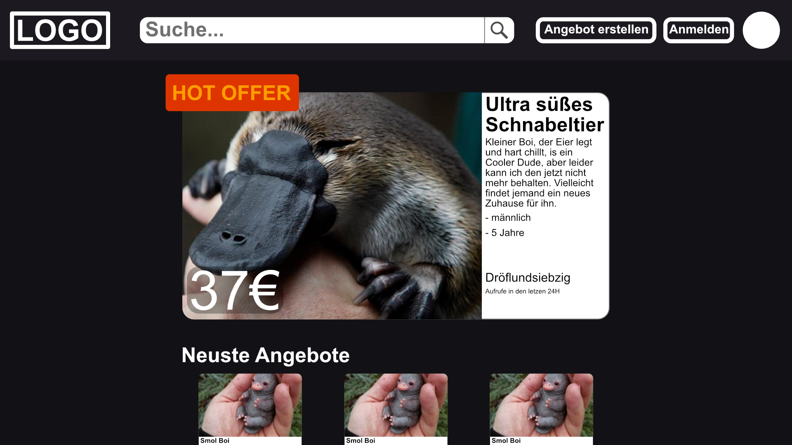
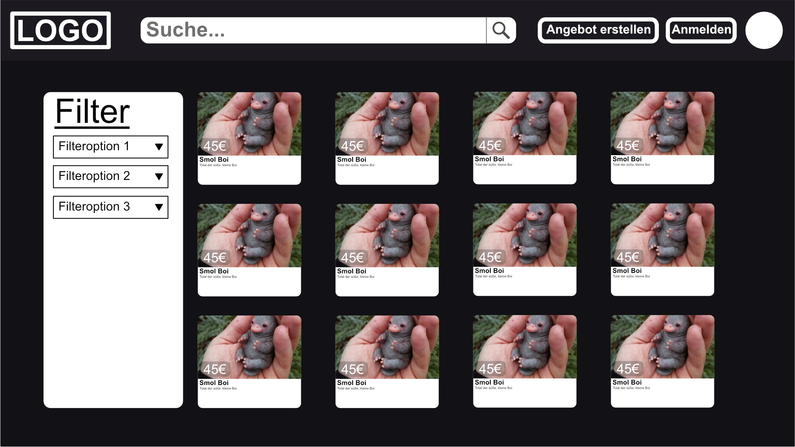
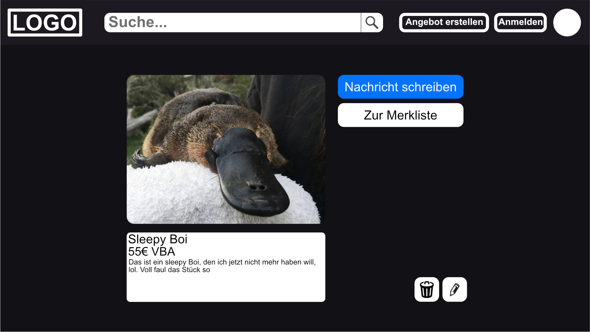
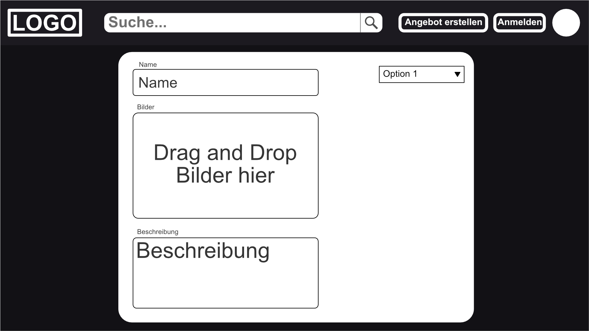
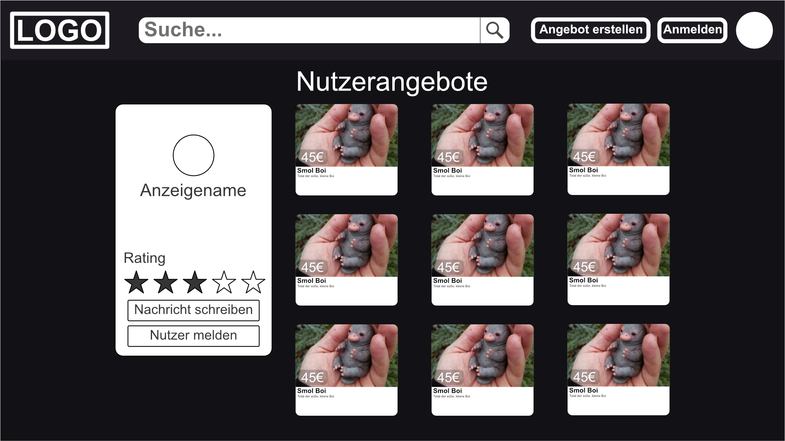
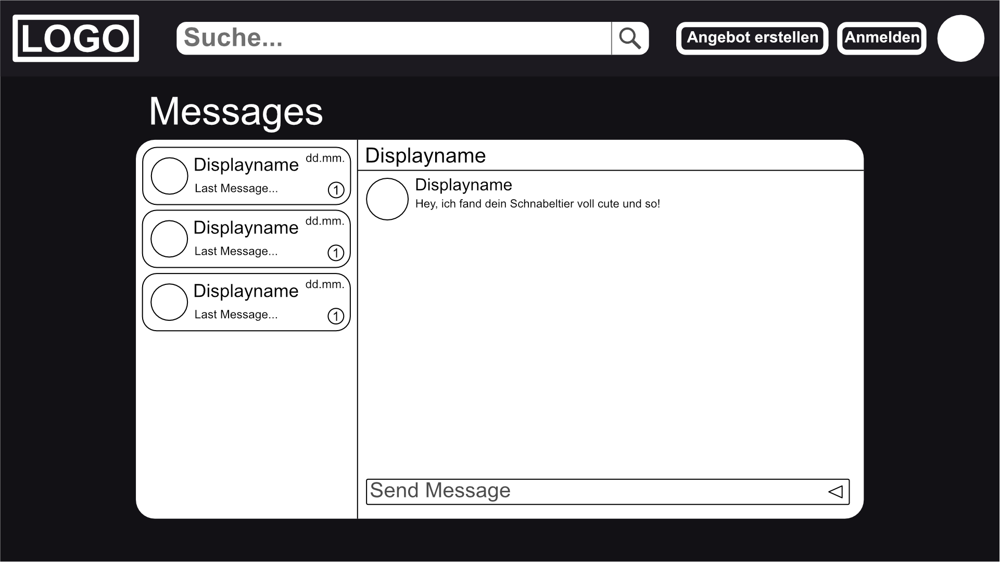
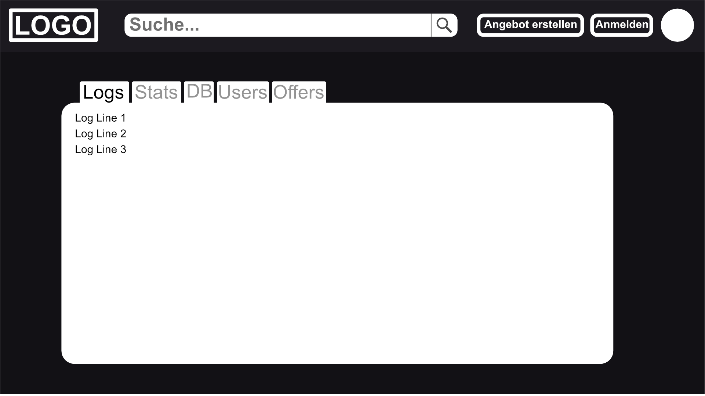

# Project Mockup 'Platypurse'

###### by Malte Grave, Tim Hesse, Marvin Kuhlmann

### Descriptions of the websites and the different pages of Platypurse

Our website will be an online marketplace for the purchase and sale of platypus, called Platypurse. Although it is a platform for a rather specific and small group of people, we still believe in its necessity. Even people with this kind of rare pets need to buy or sell them somewhere.

With our website we will support desktop and mobile devices like smartphones and tablets. Due to technical development we will not support older browsers (e.g. Internet Explorer, Netscape Navigator) and browser versions.

On this site you will be able to search for platypus offers with different filters, buy them or even sell one yourself.
If you are interested in an offer, you can write to the seller or buyer through a direct messaging system and make an agreement.
Since there will be no online checkout system, it is advisable to search for offers near your location. Then you can easily pick up your platypus.

### Now to the different pages and their functions:
#### Navbar

In the left corner of the always visible navigation bar we place our logo with an on-click event to return to the *front page*.
Next to the logo there is a search bar to search the offers by text.
On the right side of the navigation bar are the buttons to create an offer or to go to the *login page* or, if you are logged in, to your *profile page*.

#### Front Page

The *front page* offers an easy way to explore the various offers. We show you the most visited offers of the last 24 hours and also the newest ones.

#### Login Page

On the login page you can log in to your profile via your registered email address or via various services such as Facebook or Google. If no profile is registered with the mail you entered, you will be redirected to the registration form. Otherwise you will be asked for the profile password.
You will also be offered a "Forgot password" option, which will send a reset link to the specified mail.

#### Search Results

The *search results* are displayed after the input from the search bar has been processed. The results will be displayed in a grid style with cards, which will mainly consist of the first offer screen and the price. After clicking on an item, you will be taken to the *offer page* for further details. On the left-hand side, various filter options are offered.

#### Offer Page

If you are interested in an offer, you can view the details here. A picture gallery of the offer will be displayed and also additional information such as a description text, the categories for this offer, the location and of course the price.
This allows you to contact the seller, view their reviews and go directly to their *profile page*. You can also report this offer or user.

You can also share this offer with your friends via a link or social media. If you are logged in, you can add it to your list of saved offers to watch this offer.

If you are the seller, you can change or delete the offer on this page. If you are the administrator, you can also delete this offer.

#### Create Offer

To create an offer, you can upload pictures for your platypus. Actually you can edit everything you see on the *offer page*. You can also use a checkbox to specify whether your price is a basis for negotiation or a fixed price.

#### Profile Page

The *profile page* describes the profile of a user. When you visit another user, you can view their rating, write them a message, or report or block them.
If you are on your own *profile page* you will be able to see your list of Saved offers. You can also view and delete your offers. In addition, you can set your settings and language preferences on this page.

#### Message Page

This page displays your open messaging topics. You can view your latest messages and the history of older conversations.

#### Admin Panel

The admin panel provides a place for the administrators to manage users, view statistics, logs and errors or manage the database.
For each user, the administrator can manage his roles, change his email and password and enable or disable that user.
To manage the database we provide a text input field for SQL queries.

